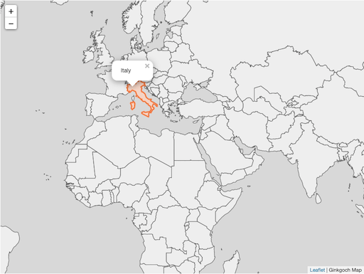

# Quick Started Demos for Ginkgoch Map

## Overview
This project will introduce some demos to guide developers to build their own map based application with `Ginkgoch Map` library. All the projects including server and client code are implemented with JavaScript only. I will progressively add demos from simple to complex scenario; use pure `core` library to some high-level wrapper APIs to simplify the code.

## Concrete Demos
### Quick Started
[This project](https://github.com/ginkgoch/map-quick-started-demos/tree/develop/core) represents several simple demos for [pure map core library](https://github.com/ginkgoch/node-map). In this page, I don't refer any other web, desktop or mobile frameworks to build rich UX application; but use few lines of code to show the power of its GIS functions.

- [Quick Started](core/README.md#quick-started)
    - [Render a simple map](core/README.md#render-a-simple-map)
    - [Render a colorful map](core/README.md#render-a-colorful-map)
- [Tutorial Begins](core/README.md#tutorial-begins)
- [Use Geometries](core/README.md#use-geometries)
    - [Create geometry and render with different styles](core/README.md#create-geometry-and-render-with-different-styles)
    - [Buffer geometry by distance](core/README.md#buffer-geometry-by-distance)
    - [Other spatial operations](core/README.md#other-spatial-operations)
- [Use Styles](core/README.md#use-styles)
    - [Use simple styles](core/README.md#use-simple-styles)
    - [Use value based style](core/README.md#use-value-based-style)
        - [Render areas based on values](core/README.md#render-areas-based-on-values)
        - [Filter and render areas based on some specific values](core/README.md#filter-and-render-areas-based-on-some-specific-values)
    - [Use Text Style](core/README.md#use-text-style)

### Build a Customized Map Server
[This project](https://github.com/ginkgoch/map-quick-started-demos/tree/develop/services) will walk you through on how to build a simple interactive map, including a set of RESTful APIs for map render, spatial query, client map view integration and how client interacts with server by RESTful API.

### More Demos are on the way
WIP...

