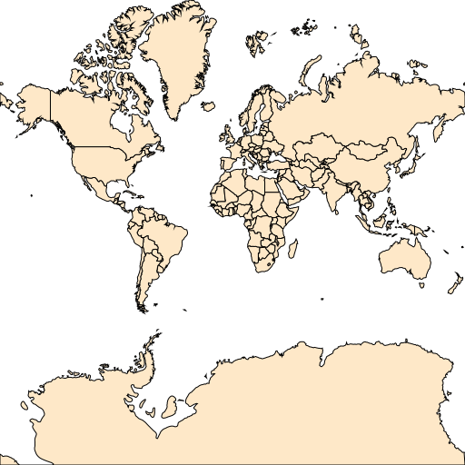
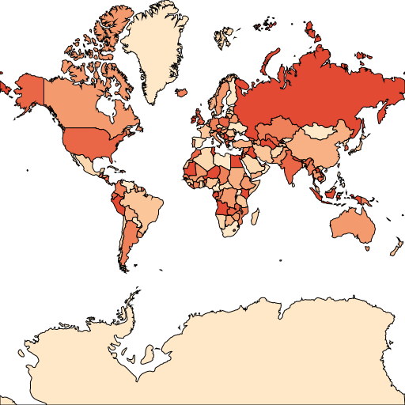
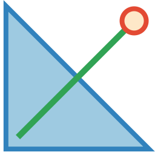
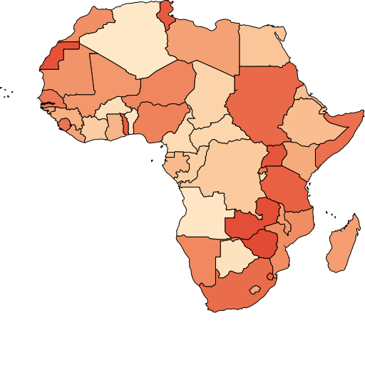
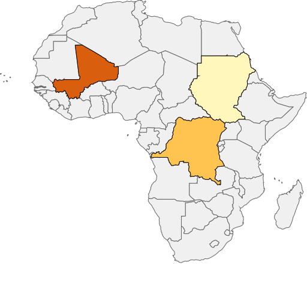
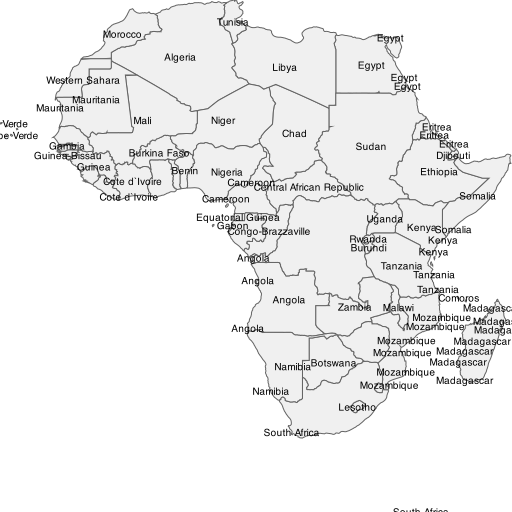

# Quick Started Demos for Map Core

This represents several simple demos for pure core library. It doesn't introduce any framework to building web, desktop or mobile. Just few lines of code to show the power of its loading, query functions.

## Prerequisite

Before we kick start the demos, we need to do some preparations. 

1. [canvas](https://www.npmjs.com/package/canvas) is a 3rd party graphics library that our map component relies on. It depends on Cairo v1.10.0 or later. Choose the corresponding command to install the dependencies.
   * macOS: `brew install pkg-config cairo pango libpng jpeg giflib librsvg`
   * Ubuntu: `sudo apt-get install build-essential libcairo2-dev libpango1.0-dev libjpeg-dev libgif-dev librsvg2-dev`
   *  `Fedora: `sudo yum install gcc-c++ cairo-devel pango-devel libjpeg-turbo-devel giflib-devel
   * Solaris: `pkgin install cairo pango pkg-config xproto renderproto kbproto xextproto`
   *  `OpenBSD: `doas pkg_add cairo pango png jpeg giflib`
   * Windows see [this wiki](https://github.com/Automattic/node-canvas/wiki/Installation:-Windows) for detail
2. Install the dependency with `yarn add canvas ginkgoch-map`.

> The demo required data (*.shp, *.json, *.csv) are located in the `data` folder in this parent folder for sharing data across multiple sample categories.

## Demos

Each js file is a standalone demo. Execute it with `node [replace with js file name]`.

### Quick Started

#### Render a simple map

[render-simple-map.js](core/quick-started/render-simple-map.js) represents how to load a shapefile and render into an image.

#### Render a colorful map

[render-colorful-map.js](core/quick-started/render-colorful-map.js) represents how to load a shapefile, then extract its property table and find out the distinct field values. When we got the distinct values, it automatically generate a `ValueStyle` to set an exclusive `FillStyle` for each values. 

### Tutorial Begins

From this section, I will introduce the very basic demos through geometry, spatial analyze, style renderer, source and layers. I try to use pretty simple demo for example with brief code to show you how to implement a small part in a GIS app. When you understand the very little functions, you could build up a complex and robust GIS app by putting them together.

### Use Geometries

#### Create geometry and render with different styles

[create-geoms.js](core/geometries/create-geom.js) represents how to create point, polygon and line geometries; then set a specific style base on various geometry type and render them into an image.

#### Buffer geometry by distance

[spatial-buffer.js](core/geometries/spatial-buffer.js) represents how to buffer a geometry with a specific distance. See the following images for difference.

* Buffers with `4` degrees
    
* Buffers with `20` degrees
    

#### Other spatial operations
We provides other [built-in spatial operations](https://ginkgoch.com/node-geom/classes/spatialops.html), the other demos are in WIP...

### Use Styles

Actually, we already represents many basic styles within the previous demos. Such as `FillStyle`, `LineStyle` or `PointStyle`. So I will skip those styles and show you some other interesting styles.

#### Use value based style

Imagine a feature source that has some specific value I am interesting, while the others are not; within the interesting values, I also want to render different colors based on the values. `ValueStyle` will be the one to satisfy this scenario.

Here represents two various scenaros for using this style.

In folder `data/Africa`, we include an Africa shapefile. Here attaches the `top 3` records to show you how the field values structure.

| ID   | CODE | COUNTRY |
| ---- | ---- | ------- |
| 1    | ALG  | Algeria |
| 2    | ANG  | Angola  |
| 3    | ANG  | Angola  |

##### Render areas based on values

[use-value-style.js](core/styles/use-value-style.js) represents how to set an exclusive fill colors based on field `CODE`.

##### Filter and render areas based on some specific values

[render-filter-values.js](core/styles/render-filter-values.js) represents how to filter and render areas with field values `MAL`,  `ZAI` and `SUD` only.

### Use Text Style

Labels are pretty importent for styling. We also support it. Check out [use-text-style.js](core/styles/use-text-style) for how to use `TextStyle` to put text on the map. This style automatically ignore the overlapping labels. If some label for small area not drawn, try to zoom deeper and you could see it when there is enough space for this label and no overlapping labels around it.

