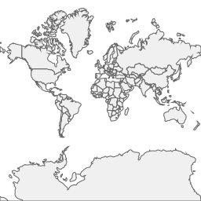

# Setup a Customized Map Server

In the previous page: [Quick Started Demos for Map Core](https://github.com/ginkgoch/map-quick-started-demos/blob/develop/README.md), I introduced the basic library of `Ginkgoch Map`. It allows developers to draw a map with shapefiles or features with thematic styles, then store it as an image on disk. It is a pretty simple and pure demo which could only guide to build some console utilities.

But `Ginkgoch` is far more powerful than that. I used to announce that `Ginkgoch Map` library allows to build cross platform server, desktop and mobile applications with only JavaScript. So today, I will try to challenge to build an interactive map. 

## Scenario

I want to build an Africa map view only on browser, I have my own Shapefiles (Countries.shp, Africa.shp). I want to set my own color for those data. Besides the static map, I want to interact with the map. Click an area and identify the area I clicked and make it highlighted. See the demo at [#]()

Let's do it!

## Prerequisite

Again, `Ginkgoch Map` is a low level map library which only focus on building map. At this stage, we need to require some other framework to help us to build service, desktop, mobile application easier. Fortunately, `Ginkgoch Map` is compatible with work with them. e.g. work with KOA to build RESTful or web applications, Electron to build desktop and React Native for mobile. In the near future, I will write more documents to cover them. But in this article, let's focus on map server or web more.

### Add Dependencies

* Koa - a lightweight web framework for node
* Koa Router - a router engine for Koa framework
* Koa Body Parser - a body parser middleware
* Canvas - the native graphics engine for node
* __Ginkgoch Map - Ginkgoch map library for server side rendering__
* Leaflet - a front-end map library

```bash
yarn add @koa/router canvas ginkgoch-map koa koa-bodyparser koa-static leaflet
```

In the next step, I'm going to build a RESTful service with XYZ tile API.

### Build XYZ Tile Service

#### Create a simple service with KOA

To setup a basic service is the first step. It is pretty easy to create a service with following code.

```javascript
const Koa = require('koa');
const bodyParser = require('koa-bodyparser');
const static = require('koa-static');

const server = new Koa();

/** 
 * the client html and relative resources are hosted by `static` middleware 
 * beneath the `assets` folder.
 */
server.use(static('./assets'));
server.use(bodyParser());

/** 
 * register the tiled map router here
 * in the next section, we are going to build the router.
 */
const mapRouter = require('./routes/map-router');
server.use(mapRouter)

server.listen(3000, () => {
    console.log('Server is listening on port 3000');
});

```

#### Create the map tile router

We design the tile API as `GET: /maps/:name/:z/:x/:y`. `:name` is the name of your map state. `:z`, `:x` and `:y` mean the `zoom level`, `column` and `row` of a specific tile. 

With this API design, the router could implement like this [map-router.js](routers/map-router.js)

```javascript
/** Note: 
 * the demo source code is a little different,
 * here I put the code together for easier reading.
 */

const Router = require('@koa/router');
const controller = require('./map-controller');
const path = require('path');
const canvasImp = require('canvas');
const gk = require('ginkgoch-map').default.all;
const {NativeFactory, ShapefileFeatureSource, FeatureLayer, FillStyle, MapEngine, Srs} = gk;
/** 
 * due to the RESTful service is stateless,
 * whenever getting one tile will create a map instance 
 * which will slow down the performance.
 * so here we create a cache for map instances just reuse the map instance
 */
const mapStatesCache = new Map();
const router = new Router();
NativeFactory.registerFrom(canvasImp);

router.get('/maps/:name/:z/:x/:y', async ctx => {
    let { name, x, y, z } = ctx.params;
    if (!mapStatesCache.has(name)) {
        let sourcePath = path.resolve(__dirname, `../../data/cntry02-900913.shp`);
        let source = new ShapefileFeatureSource(sourcePath);
        let layer = new FeatureLayer(source);
        layer.styles.push(new FillStyle('#f0f0f0', '#636363', 1));
        let mapEngine = new MapEngine(256, 256);
        mapEngine.srs = new Srs('EPSG:900913');
        mapEngine.pushLayer(layer);
        mapStatesCache.set(name, mapEngine);
    } 

    let mapEngine = mapStatesCache.get(name);
    let mapImage = await controller.xyz(mapEngine, z, x, y);

    let buff = ctx.body = mapImage.toBuffer();
    ctx.type = 'png';
    ctx.length = buff.length;
});

module.exports = router;
```

 #### Service ready

Let's open a browser and type url `localhost:3000/maps/default/0/0/0`, the tile image with the world map will respond.



At this step, we know how to an API for XYZ tile. How could we build an interactive map? Let keep working on the front-end part in the next section.

#### Build interactive map view with Leaflet

In this section, we will work on front-end only - build interactive map view with `Leaflet` (you could choose any client map library such as `OpenLayers` as well).

In our demo, we put all client code under `assets` folder and copy the `leaflet` related resources underneath the `assets/deps` folder. 

Then create `assets/index.html` as following:

```html
<!DOCTYPE html>
<html lang="en">
<head>
    <title>DEMO MAP UI - Ginkgoch</title>
    <link rel="stylesheet" href="deps/leaflet.css">
    <style>
    #mapContainer {
        width: 800px;
        height: 600px;
        margin: 0 auto;
    }
    </style>
</head>
<body>
    <div id="mapContainer"></div>
    <script type="text/javascript" src="deps/leaflet.js"></script>
    <script>
        let mapView = L.map('mapContainer').setView([51.505, -0.09], 3);
        L.tileLayer('http://localhost:3000/maps/default/{z}/{x}/{y}', {
					attribution: 'Ginkgoch Map',
          id: 'ginkgoch-base-map'
				}).addTo(mapView);
    </script>
</body>
</html>
```

That's all for our basic map application. I will try to make those steps as a template just help to build the server and client part easier later. With the power of `Leaflet`, you could drag to pan the map and scroll to zoom on the map.


#### Identify the countries by clicking

We have one last feature not implemented - `identify`. It is a pretty common operation which allows you to click on the map, find out what countries are intersected within the clicked area, and prompt a popup to show the informations.

WIP...


